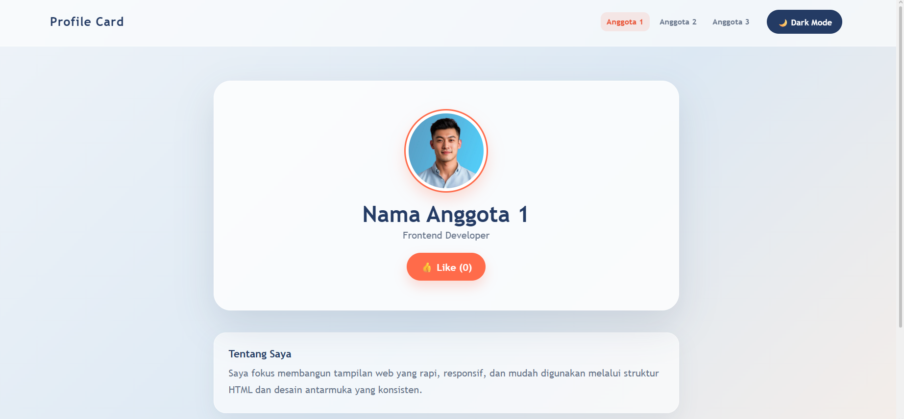
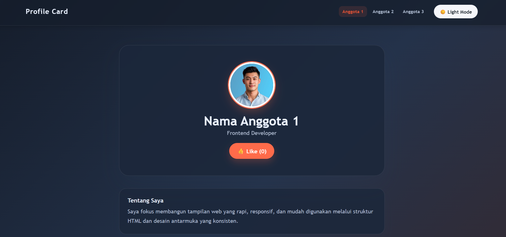

# Website Profile Card BNCC 🚀
Website Profile Card BNCC ini adalah halaman kartu profil interaktif yang menampilkan data informasi anggota tim secara dinamis dan responsif, dibuat sebagai study case kolaborasi tim dalam Workshop Git & GitHub.

---

## Visualisasi 📷

<!-- Tempel screenshot tampilan halaman di sini, atau link demo (misalnya GitHub Pages).-->

Live Demo:  [Klik di Sini untuk Mencoba Website](https://tashaab1101.github.io/website-gitready/)
---

## Tech Stack 🛠️
- HTML5
- CSS3
- JavaScript (Vanilla)
- Git & GitHub

---

## Fitur Utama ✨
- [x] Toggle Dark Mode / Halaman Interaktif
- [x] Tampilan kartu profil dinamis
- [x] Responsive layout untuk desktop dan mobile
- [x] Navigasi menu perpindahan profil anggota tim yang responsif

---

## Contribution 👥

| Name | Role | Kontribusi |
|---|---|---|
| [Tasha](https://github.com/tashaab1101) | Project Initiator | Membuat repository utama kelompok, mengatur dan mengundang akses kolaborator tim, memasukkan file starter `index.html`, serta melakukan review dan merge seluruh Pull Request dari branch fitur ke branch utama. |
| [Jihan](https://github.com/jihanz-ai) | Styling Engineer | Membuat branch `styling`, mendesain seluruh tampilan visual dan tata letak halaman web di file `style.css`, serta menghubungkannya ke berkas HTML utama. |
| [Calysta](https://github.com/calystaartysia) | Script Engineer | Membuat branch khusus JavaScript, memprogram fungsionalitas logika interaktif halaman pada file `script.js`, serta menyambungkannya ke berkas HTML. |

---

## What We've Learned 💡

Melalui studi kasus proyek kolaboratif ini, kelompok kami mempelajari banyak hal baru antara lain:
- **Konsep Alur Kerja Git Real-World:** Memahami pentingnya membuat fitur baru di dalam branch terpisah (`feature branch`) agar tidak mengacaukan atau merusak kode utama di branch `main`.
- **Code Review & Pull Request:** Merasakan langsung bagaimana proses pengajuan kode formal dilakukan melalui Pull Request (PR) dan pentingnya memberikan komentar tinjauan sebelum kode digabungkan.
- **Manajemen Konflik Kode (Merge Conflict):** Belajar cara taktis mendeteksi dan menyelesaikan konflik kode secara damai ketika dua orang anggota tim melakukan modifikasi pada file yang sama (`index.html`).

---

## Feature Improvement 🚀 

Ide pengembangan lanjutan jika project ini dilanjutkan, misalnya:

- Menyimpan data profil atau status pilihan pengguna ke `localStorage` agar tidak hilang saat halaman di-refresh.
- Menambahkan animasi transisi yang lebih halus (*smooth transition effect*) saat berpindah antar profil anggota.
- Menambahkan fitur interaktif tambahan seperti tombol *Like Counter* di setiap kartu profil.
- Melakukan deploy otomatis via GitHub Actions ke GitHub Pages agar website dapat diakses publik secara online melalui internet.
